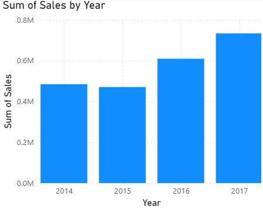
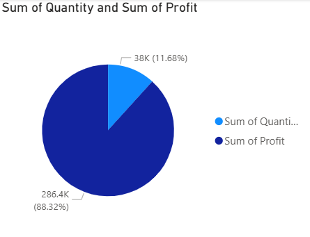
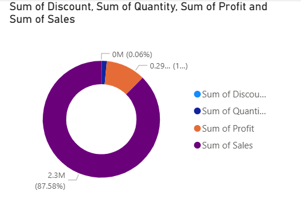
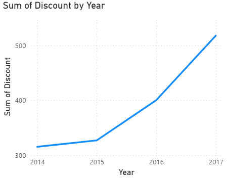
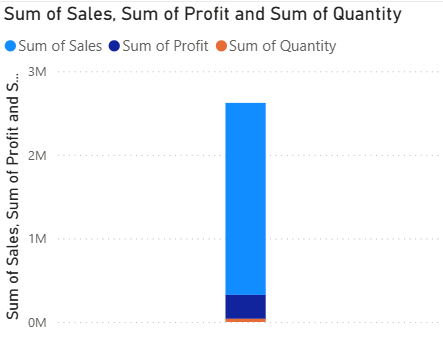
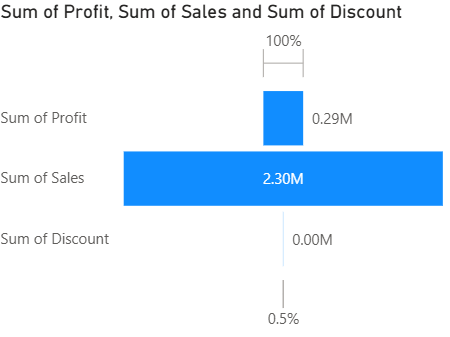
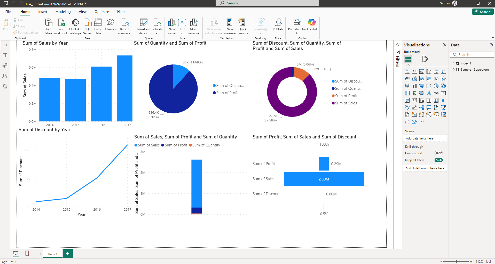

## Data Visualization & Storytelling - Superstore Sales

### Introduction

+ The purpose of this report is to present insights from the Superstore dataset using Power BI. The visualizations focus on sales, profit, quantity, and discount across different dimensions. Each chart provides a unique perspective to help understand business performance and trends.

### Visualizations & Insights

#### Sum of Sales by Years (Bar Chart)

+ This chart shows the total sales aggregated by year. It helps identify growth trends and       compare yearly performance.

#### Sum of Quantity and Sum of Profit (Pie Chart)

- This chart provides a breakdown of total quantity sold and total profit, giving a quick view of contribution percentages.

#### Sum of Discount, Quantity, Profit, and Sales (Donut Chart)

+ The donut chart illustrates the relative contribution of discount, quantity, profit, and sales.

#### Sum of Discount by Year (Line Chart)

+ highlights discount trends over time, showing any fluctuations or seasonal patterns.

#### Sum of Sales, Sum of Profit, and Sum of Quantity (Combined Chart)

+ This visualization compares sales, profit, and quantity together to understand overall business balance.

#### Sum of Profit, Sum of Sales, and Sum of Discount (Combined Chart)

+ This chart presents profit, sales, and discount together, helping identify trade-offs between revenue and discounting strategy.

### Final Dashboard 

### Conclusion

+ The analysis of the Superstore dataset using Power BI highlights key performance indicators such as sales, profit, quantity, and discount. These insights provide a clearer understanding of yearly trends, product performance, and the impact of discounting strategies. Decision-makers can use these findings to optimize pricing, inventory, and sales strategies.

